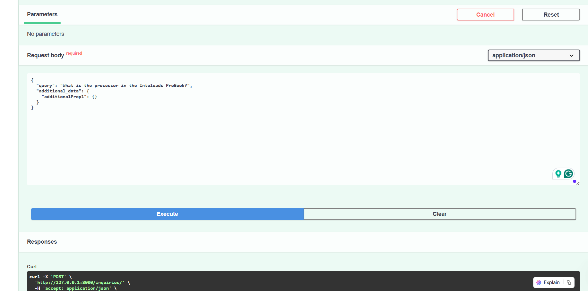
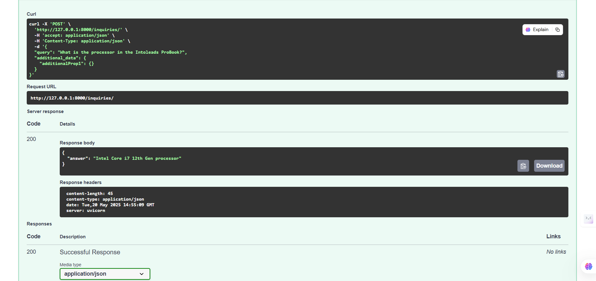
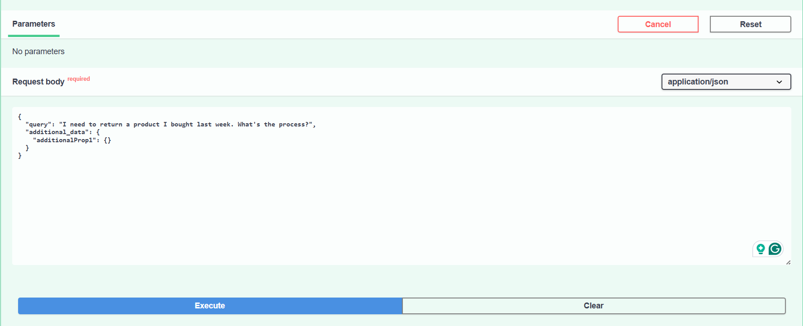
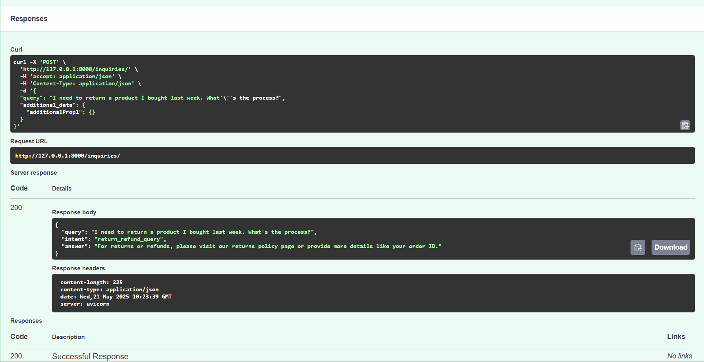
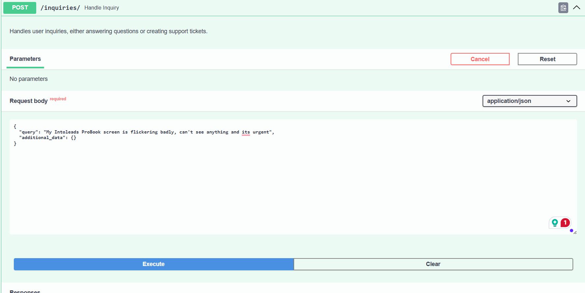
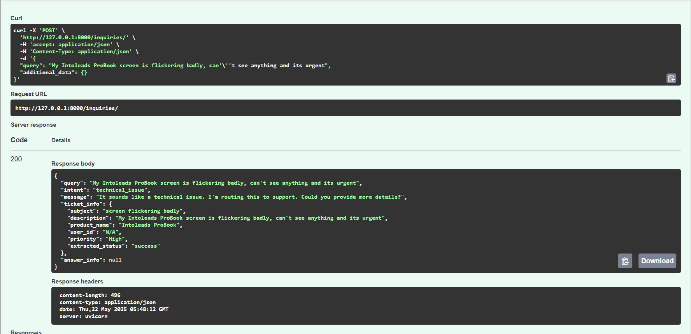

AI Customer Service Assistant
🚀 Overview
This project implements a FastAPI service that acts as an intelligent customer service assistant. It leverages a Large Language Model (LLM) framework (LangChain with Hugging Face models) to classify user intent and provide appropriate responses. Key functionalities include answering product-related questions by retrieving information from provided documentation and extracting structured details for support tickets using AI-driven field mapping.

✨ Features
Unified API Endpoint: A single HTTP POST endpoint (/inquiries/) to handle all user requests.

AI-Powered Intent Classification: Automatically determines if a user's query is a product question, support ticket request, technical issue, general greeting, order status inquiry, or return/refund query.

Retrieval Augmented Generation (RAG): Answers product questions by retrieving relevant information from provided documentation.

AI-Driven Field Mapping: Extracts key information (subject, description, product name, user ID, priority) from support ticket requests for ticket creation.

Robust Error Handling: Provides friendly fallback messages in case of issues with LLM processing or data retrieval.

🛠️ Technologies Used
FastAPI: Python web framework for building the API.

LangChain: Framework for developing applications powered by LLMs.

Hugging Face Transformers: Used for:

Zero-Shot Classification pipeline (facebook/bart-large-mnli) for intent classification.

Generative LLM (google/flan-t5-base) for question answering and information extraction.

ChromaDB: Vector store for efficient storage and retrieval of document embeddings.

PyTorch: Underlying deep learning library for Hugging Face models.

Uvicorn: ASGI server for running the FastAPI application.

Pydantic: Data validation and settings management (used by FastAPI).

📦 Project Structure
.
├── main.py                     # FastAPI application entry point, handles API routes and orchestrates logic
├── llm_logic.py                # Contains core LLM interactions (intent classification, Q&A, ticket extraction)
├── document_processor.py       # Handles document loading, text chunking, embedding, and vector store creation
├── requirements.txt            # Lists all Python dependencies for easy installation
├── Intoleads Task.pdf          # Example product documentation (or similar PDFs used for RAG)
├── README.md                   # This file, providing project overview and instructions
├── .gitignore                  # Specifies files and directories to be ignored by Git (e.g., virtual environments, cache)
└── assets/                     # Folder for static assets like images
    └── images/                 # Stores screenshots and other images

⚙️ Setup and Installation
Prerequisites
Python 3.9+

pip (Python package installer)

An active internet connection (for initial model downloads by Hugging Face)

Steps
Clone the repository:

git clone https://github.com/Tejaswini-Premkumar/FastAPI-LLM-Assistant
cd FastAPI-LLM-Assistant

Create a virtual environment (recommended):

python -m venv venv
source venv/bin/activate  # On Windows: venv\Scripts\activate

Install dependencies:

pip install -r requirements.txt

(Please make sure your requirements.txt was generated correctly and contains all necessary libraries.)

Prepare Product Documents:

Place your product documentation (e.g., Intoleads Task.pdf or other .pdf, .txt files) in the project's root directory. The document_processor.py is configured to process these files to build the knowledge base for RAG.

Running the Application
Start the FastAPI server:

uvicorn main:app --reload --host 0.0.0.0 --port 8000

--reload: Enables automatic server reloading on code changes (useful for development).

--host 0.0.0.0: Makes the server accessible from other devices on your network.

--port 8000: Specifies the port the application will run on.

The application will typically be accessible at http://localhost:8000.

Access FastAPI Docs (Optional):

Once running, you can access the interactive API documentation (Swagger UI) at http://localhost:8000/docs to test the endpoint directly from your browser.

🧪 Usage Examples
The service exposes a single POST endpoint /inquiries/ for all interactions.

Request Body (UserInput Model)
{
  "query": "string",
  "additional_data": {} (optional)
}

Response Body (AnswerResponse Model)
{
  "query": "string",
  "intent": "string",
  "message": "string",
  "ticket_info": {
    "subject": "string",
    "description": "string",
    "product_name": "string",
    "user_id": "string",
    "priority": "string",
    "extracted_status": "string"
  } (optional),
  "answer_info": {
    "answer": "string",
    "sources": [
      "string"
    ]
  } (optional)
}

Example Queries
You can use curl commands in your terminal or the interactive Swagger UI (http://localhost:8000/docs) to send requests.

1. Product Question
This example demonstrates how the assistant answers questions about product specifications by retrieving information from its loaded knowledge base.

Query: What is the processor in the Intoleads ProBook?
Expected Intent: product_question

Curl Command:

curl -X POST "http://localhost:8000/inquiries/" \
     -H "Accept: application/json" \
     -H "Content-Type: application/json" \
     -d '{
           "query": "What is the processor in the Intoleads ProBook?"
         }'

Swagger UI Request Body:

Swagger UI Server Response:

2. Return/Refund Query
This demonstrates the classification of a return/refund query and the corresponding generic response guiding the user.

Query: I need to return a product I bought last week. What's the process?
Expected Intent: return_refund_query

Curl Command:

curl -X POST "http://localhost:8000/inquiries/" \
     -H "Accept: application/json" \
     -H "Content-Type: application/json" \
     -d '{
           "query": "I need to return a product I bought last week. What\'s the process?",
         }'

Swagger UI Request Body:

Swagger UI Server Response:

3. Technical Issue / Support Ticket Request
This example highlights the AI's ability to classify technical issues and extract key information for creating a structured support ticket. Notice how subject, product_name, and priority are extracted automatically.

Query: My Intoleads ProBook screen is flickering badly, can't see anything and its urgent
Expected Intent: technical_issue

Curl Command:

curl -X POST "http://localhost:8000/inquiries/" \
     -H "Accept: application/json" \
     -H "Content-Type: application/json" \
     -d '{
           "query": "My Intoleads ProBook screen is flickering badly, can\'t see anything and its urgent"
         }'

Swagger UI Request Body:

Swagger UI Server Response (showing extracted ticket info):

